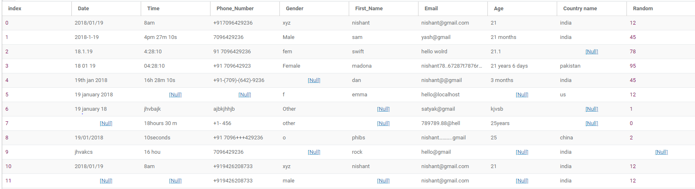
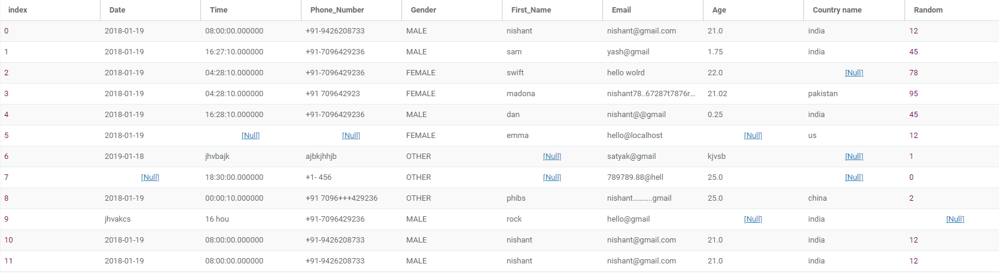
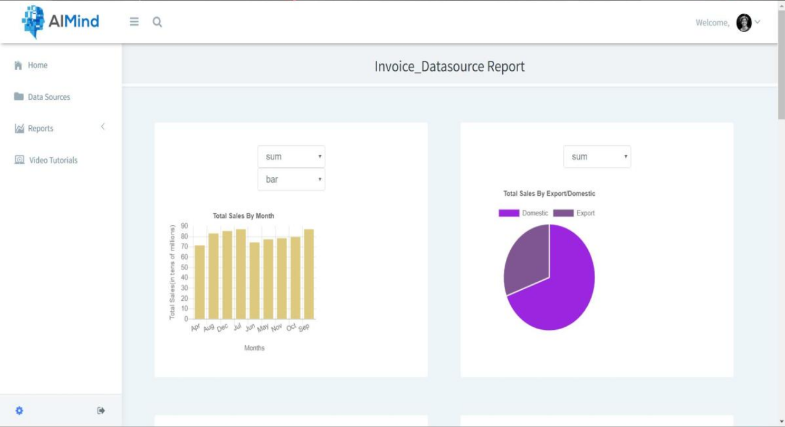
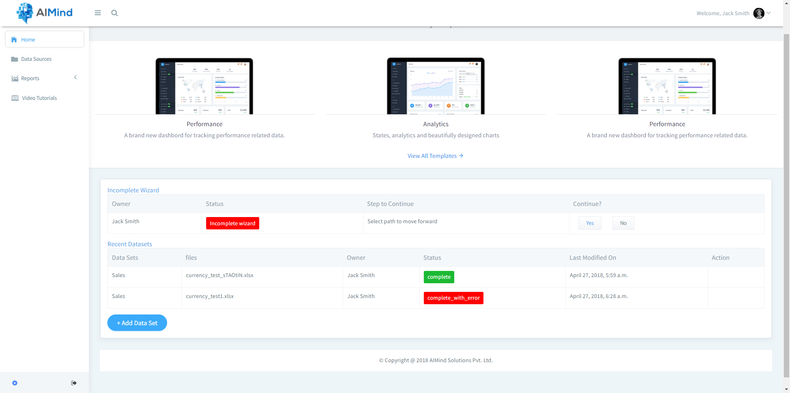
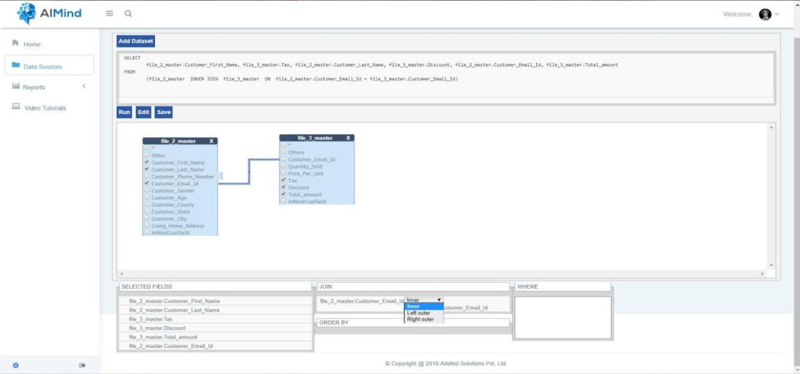

## Automated ETL and Statistical Dashboard

### A web application which automatically cleans user data and shows statistical report of that data.

[Video demo of this project](https://www.useloom.com/share/e379a633b9b54616a2a05bf0ce5ac88f)

**This is what your original data may look like.** :

**This is what happened to your data! It looks good now, all handled by this application.**

**It can also generate statistical reports automatically.**

**You can see all data cleaning activities and log on the dashboard.**

**you can also combine two data sets (files) or even subsets of them just by drag and drop using this data source generator.**

### Technology used:
1. **Django Framework**
..* For building the web application.
2. **Pandas and numpy**
..* For entire ETL and cleaning part.
3. **chart.js**
..* For showing Interactive statistical graphs.
4. **R** 
..* For statistical operations on data.
5. **MySQL**
..* For data base of this project and customers database.